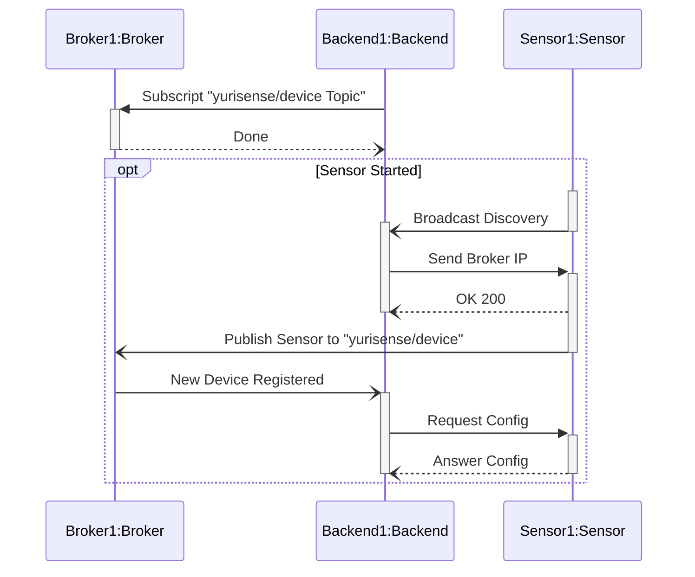

# Sensor Discovery Process

```mermaid
sequenceDiagram
    participant b as Broker1:Broker
    participant bb as Backend1:Backend
    participant s as Sensor1:Sensor
    bb->>+b: Subscript "yurisense/device Topic"
    b--)-bb: Done
    opt Sensor Started
        activate s
        s-)+bb: Broadcast Discovery
        deactivate s
        bb->>+s: Send Broker IP
        s--)bb: OK 200
        deactivate bb
        s-)-b: Publish Sensor to "yurisense/device"
        b-)+bb: New Device Registered
        bb->>+s: Request Config
        s--)-bb: Answer Config
        deactivate bb
    end
```

# Login Process
```mermaid

```