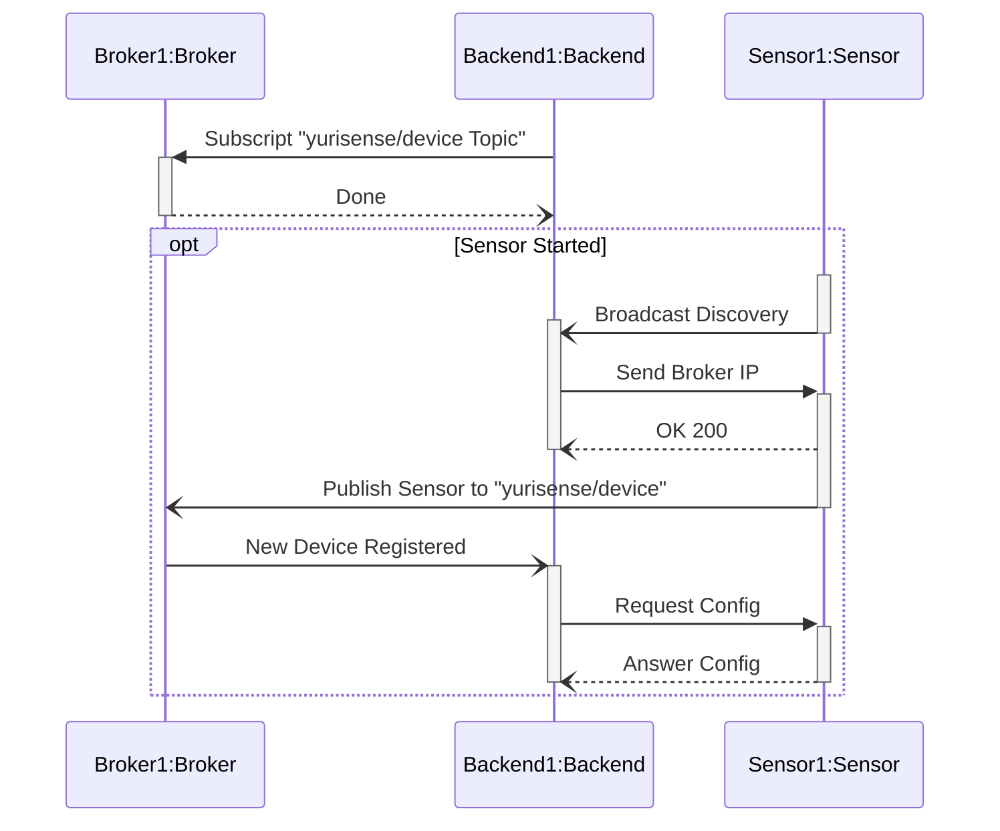
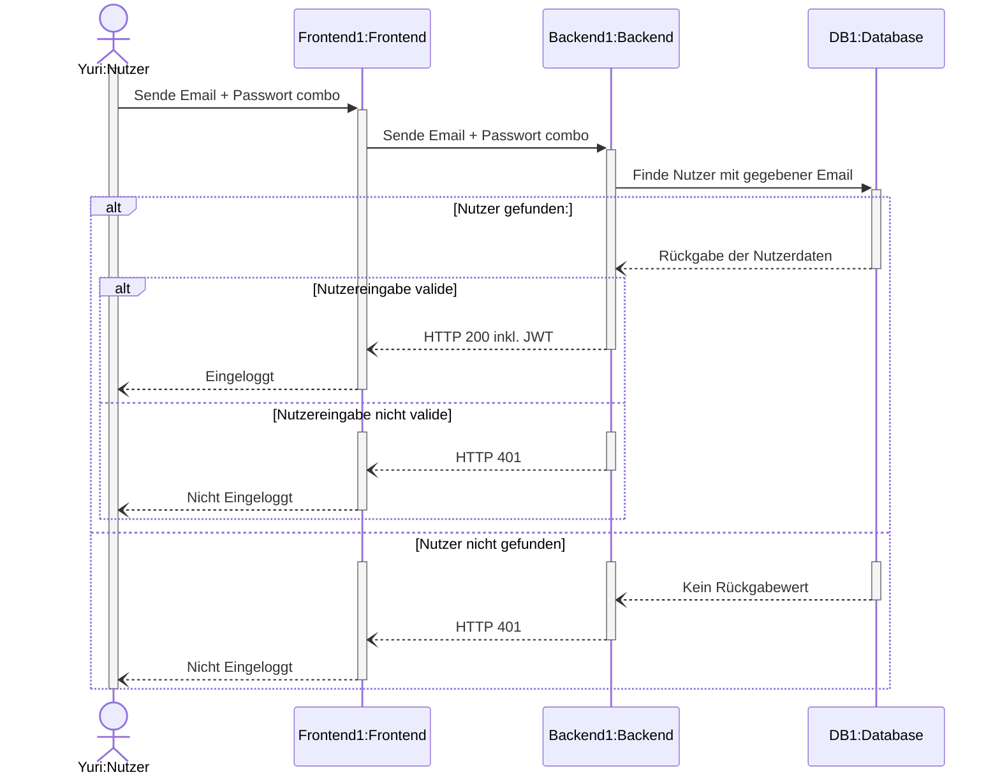

# Sensor Discovery Process

```mermaid
sequenceDiagram
    participant b as Broker1:Broker
    participant bb as Backend1:Backend
    participant s as Sensor1:Sensor
    bb->>+b: Subscript "yurisense/device Topic"
    b--)-bb: Done
    opt Sensor Started
        activate s
        s-)+bb: Broadcast Discovery
        deactivate s
        bb->>+s: Send Broker IP
        s--)bb: OK 200
        deactivate bb
        s-)-b: Publish Sensor to "yurisense/device"
        b-)+bb: New Device Registered
        bb->>+s: Request Config
        s--)-bb: Answer Config
        deactivate bb
    end
```

# Login Process

```mermaid
sequenceDiagram
    actor User as Yuri:Nutzer
    participant Frontend as Frontend1:Frontend
    participant Backend as Backend1:Backend
    participant Datenbank as DB1:Database
    activate User
    User->>+Frontend: Sende Email + Passwort combo
    Frontend->>+Backend: Sende Email + Passwort combo
    Backend->>+Datenbank: Finde Nutzer mit gegebener Email
    alt Nutzer gefunden:
        Datenbank--)-Backend: Rückgabe der Nutzerdaten
        alt Nutzereingabe valide
            Backend--)-Frontend: HTTP 200 inkl. JWT
            Frontend--)-User: Eingeloggt
        else Nutzereingabe nicht valide
            activate Backend
            activate Frontend
            Backend--)-Frontend: HTTP 401
            Frontend--)-User: Nicht Eingeloggt
        end
    else Nutzer nicht gefunden
        activate Datenbank
        activate Backend
        activate Frontend
        Datenbank--)-Backend: Kein Rückgabewert
        Backend--)-Frontend: HTTP 401
        Frontend--)-User: Nicht Eingeloggt
    end
    deactivate User
```